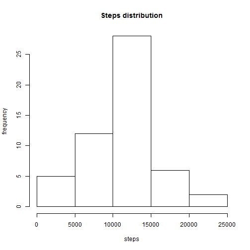
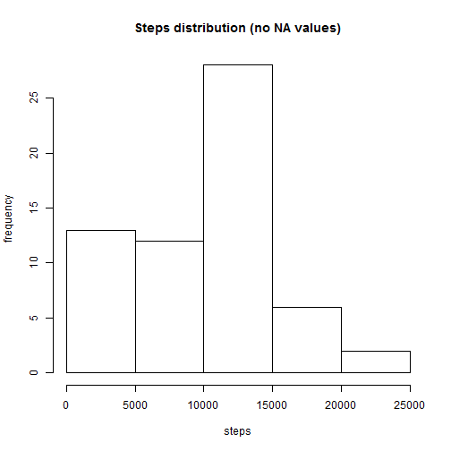
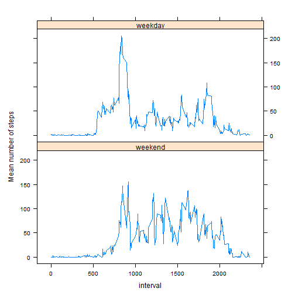

## Loading and preprocessing the data
To meet the requested this task, you must start loading the data, cleaning them and formatting them properly.


```r
library(chron)
library(dplyr)
## Decompress the zip file to the same path
unzip(zipfile = "activity.zip")

## Read the csv file and store it in a data.frame while sort the variables
## in a specific order
fdata <- select(tbl_df(read.csv("activity.csv")),date, interval, steps)
```

## What is mean total number of steps taken per day?
This question requires an aggregation of the data in terms of steps per day. To do this you need to add up all the steps a day.


```r
steps_by_day <- aggregate(steps ~ date, fdata, sum)
summary(steps_by_day)
```

```
##          date        steps      
##  2012-10-02: 1   Min.   :   41  
##  2012-10-03: 1   1st Qu.: 8841  
##  2012-10-04: 1   Median :10765  
##  2012-10-05: 1   Mean   :10766  
##  2012-10-06: 1   3rd Qu.:13294  
##  2012-10-07: 1   Max.   :21194  
##  (Other)   :47
```

At this point it is possible to check the frequency distribution of the number of steps by means of a histogram.

```r
hist(steps_by_day$steps, 
     main = "Steps distribution",
     ylab = "frequency",
     xlab = "steps")
```

 

Finnaly one needs to calculate the mean and median number of steps per day.

```r
mean_steps <- mean(steps_by_day$steps, na.rm = TRUE)
medi_steps <- median(steps_by_day$steps, na.rm = TRUE)
```

The result follows:  
**Mean** of steps taken by day is **10766.19**   
**Median** of steps taken by day is **10765**.  

----

## What is the average daily activity pattern?
* Make a time series plot (i.e. type = "l") of the 5-minute interval (x-axis) and the average number of steps taken, averaged across all days (y-axis)

```r
mean_steps_by_interval <- aggregate(steps~interval, fdata, mean, na.rm=TRUE )
with(mean_steps_by_interval, 
        plot(interval,steps,type = "l" ))
```

 


* Which 5-minute interval, on average across all the days in the dataset, contains the maximum number of steps?

```r
max_mean <- mean_steps_by_interval[which.max(mean_steps_by_interval$steps),]$interval
```
That interval is the 835th interval.

----
## Imputing missing values
Calculate and report the total number of missing values in the dataset (i.e. the total number of rows with NAs)


```r
totalMissingValues <- sum(is.na(fdata$steps))
```
the total missing values is **2304**.

Devise a strategy for filling in all of the missing values in the dataset. The strategy does not need to be sophisticated. For example, you could use the mean/median for that day, or the mean for that 5-minute interval, etc.

the strategy I used is to fill missing values with the median value for that interval across all days.

```r
## Calculate the median for al intervals
stepsIntervalMode <- aggregate(steps~interval, fdata, median)

## create a function to get the median given an interval
getMedian<-function(intervalIn){
        stepsIntervalMode[stepsIntervalMode$interval==intervalIn,]$steps
}
```


Create a new dataset that is equal to the original dataset but with the missing data filled in.

```r
## Duplicate the data file
fdata2 <- fdata

## Fill all the NA values
rows <- nrow(fdata2)
for (i in 1:rows) {
        fdata2[i,]$steps <- ifelse(is.na(fdata2[i,]$steps), 
                                   getMedian(fdata2[i,]$interval),
                                   fdata2[i,]$steps)
}
```

Make a histogram of the total number of steps taken each day and Calculate and report the mean and median total number of steps taken per day. 
Do these values differ from the estimates from the first part of the assignment? What is the impact of imputing missing data on the estimates of the total daily number of steps?


```r
steps_by_day2 <- aggregate(steps ~ date, fdata2, sum)
hist(steps_by_day2$steps, 
     main = "Steps distribution (no NA values)",
     ylab = "frequency",
     xlab = "steps")
```

 

```r
mean_steps2 <- mean(steps_by_day2$steps)
medi_steps2 <- median(steps_by_day2$steps)
```

Values of mean and median - comparision with the original values  

 Function | No NA Values             | Original values  
--------- | ---------------------- | ----------------------  
Mean      | 9503.869   |  10766.19  
Median    | 10395   |  10765  

The values set to missing data pushed down either the mean and median of the sum of steps given by day.  

## Are there differences in activity patterns between weekdays and weekends?
For this part the weekdays() function may be of some help here. Use the dataset with the filled-in missing values for this part.

Create a new factor variable in the dataset with two levels - "weekday" and "weekend" indicating whether a given date is a weekday or weekend day.

```r
## Add a column with the corresponding type of day (weekday or weekend).
fdata2 <- mutate(fdata2,
                 day = factor(is.weekend(date), 
                              c(TRUE, FALSE), 
                              c("weekend", "weekday")))
```

Make a panel plot containing a time series plot (i.e. type = "l") of the 5-minute interval (x-axis) and the average number of steps taken, averaged across all weekday days or weekend days (y-axis). The plot should look something like the following, which was created using simulated data:


```r
library(lattice)
xyplot(steps~interval|day,
       aggregate(steps~interval+day,fdata2,mean),
       aspect = 1/2,
       type="l",
       layout=c(1,2),
       ylab = "Mean number of steps")
```

 
